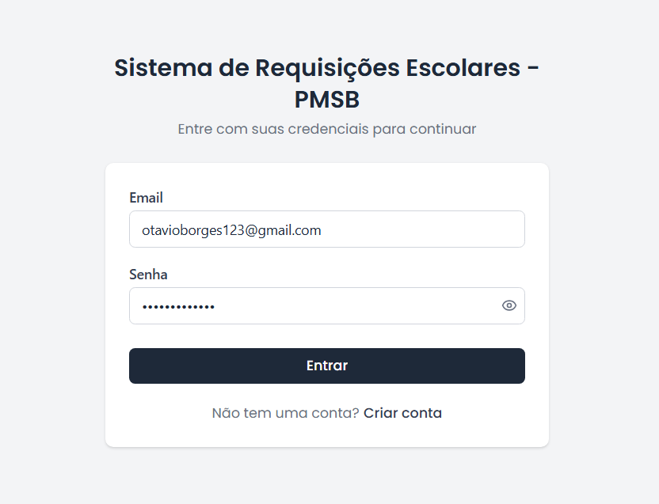
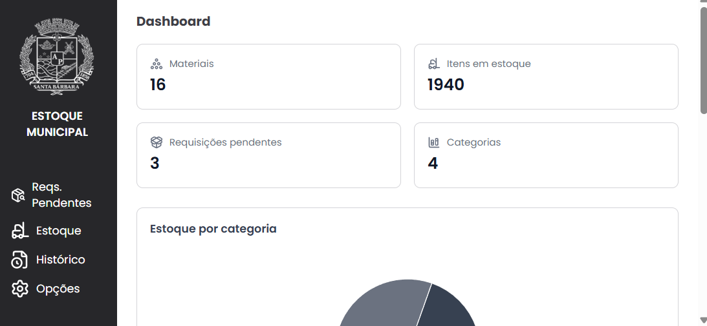
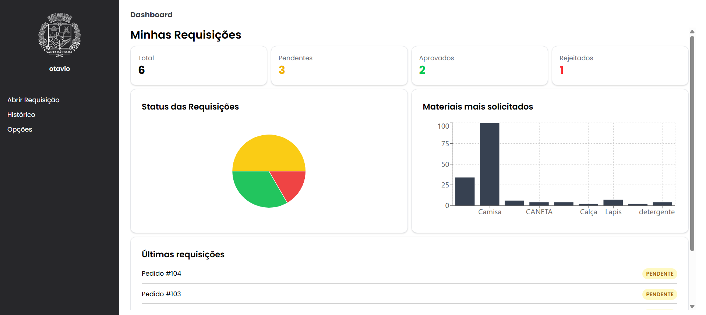
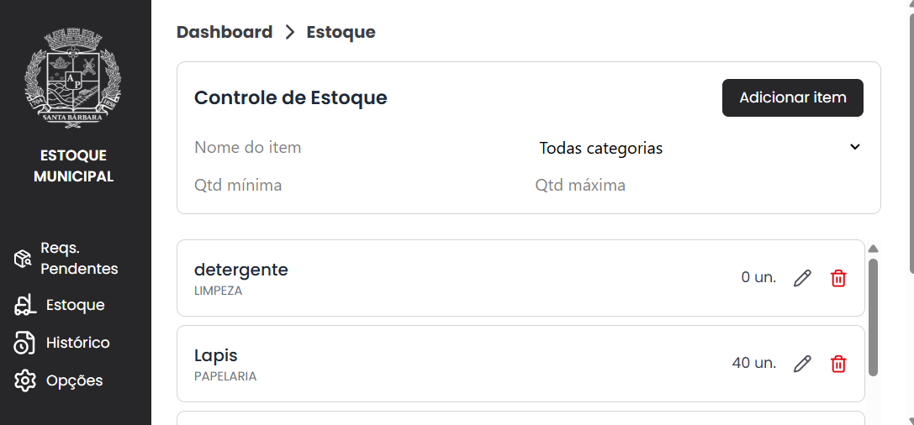
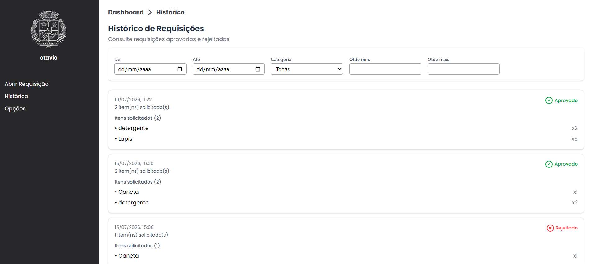
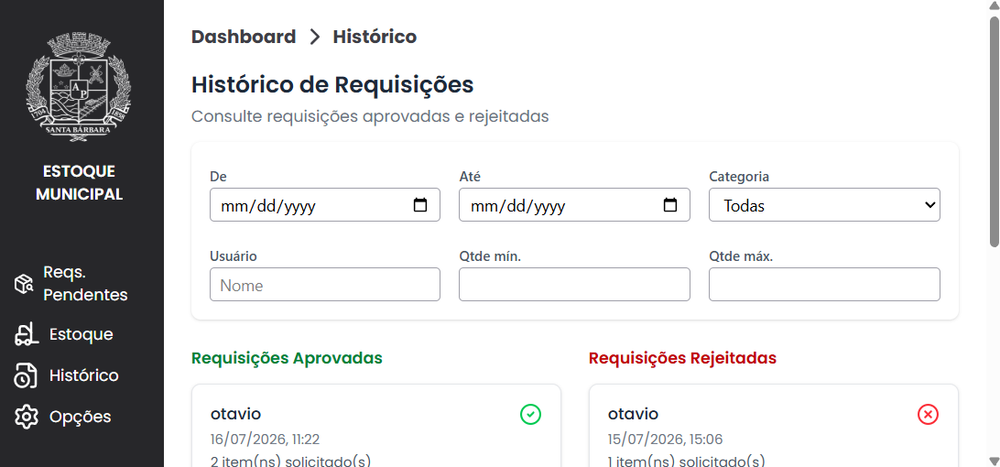
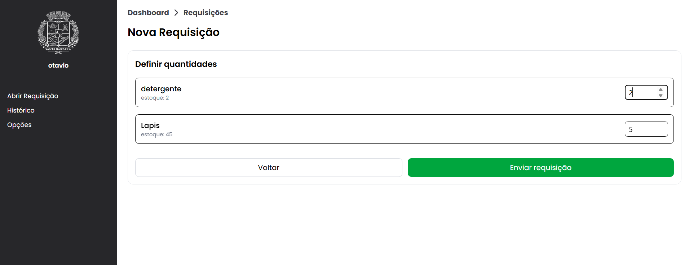
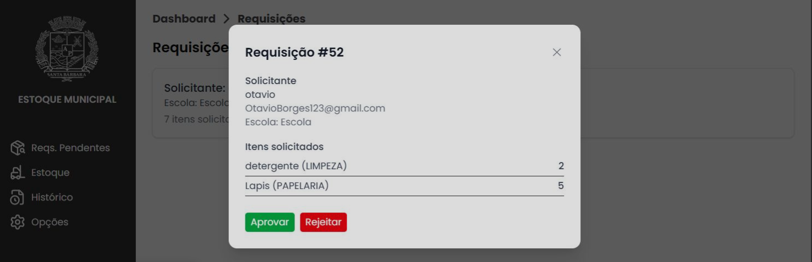
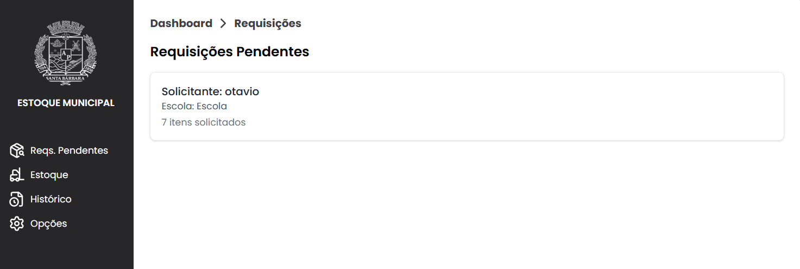

# Sistema de Gestão de Estoque

Aplicação Full Stack desenvolvida para gerenciamento de estoque e controle de requisições de materiais.

## Objetivo

O projeto simula um ambiente corporativo onde diferentes usuários podem solicitar materiais disponíveis em estoque, enquanto administradores realizam o gerenciamento completo do sistema.

## Tecnologias

Backend

- Java 21
- Spring Boot
- Spring Security
- JWT
- JPA / Hibernate
- POSTGRES
- Maven

## Funcionalidades

 ### Autenticação
- Login com JWT
- Cadastro de usuários
- Controle de permissões por perfil
### Estoque
- Cadastro de materiais
- Atualização de materiais
- Exclusão de materiais
- Consulta por categoria
- Consulta de materiais sem estoque
### Requisições
- Criação de requisições
- Aprovação e rejeição
- Histórico
- Consulta por usuário
---

## Telas do Sistema

### Login

---

### Dashboard do Administrador

---

### Dashboard do Usuário

---

### Estoque

---

### Histórico

### Histórico Estoque

### Requisição

---
## Arquitetura

- Controller
- Service
- Repository
- DTO
- Entity

## Autores

- Back End - Otávio C. Borges
- Front End - Roger Aguiar

Observação: Este repositório concentra o desenvolvimento da API REST. O frontend foi desenvolvido em colaboração, sendo de responsabilidade de Roger Aguiar, enquanto toda a implementação do backend foi desenvolvida por Otávio C. Borges.
